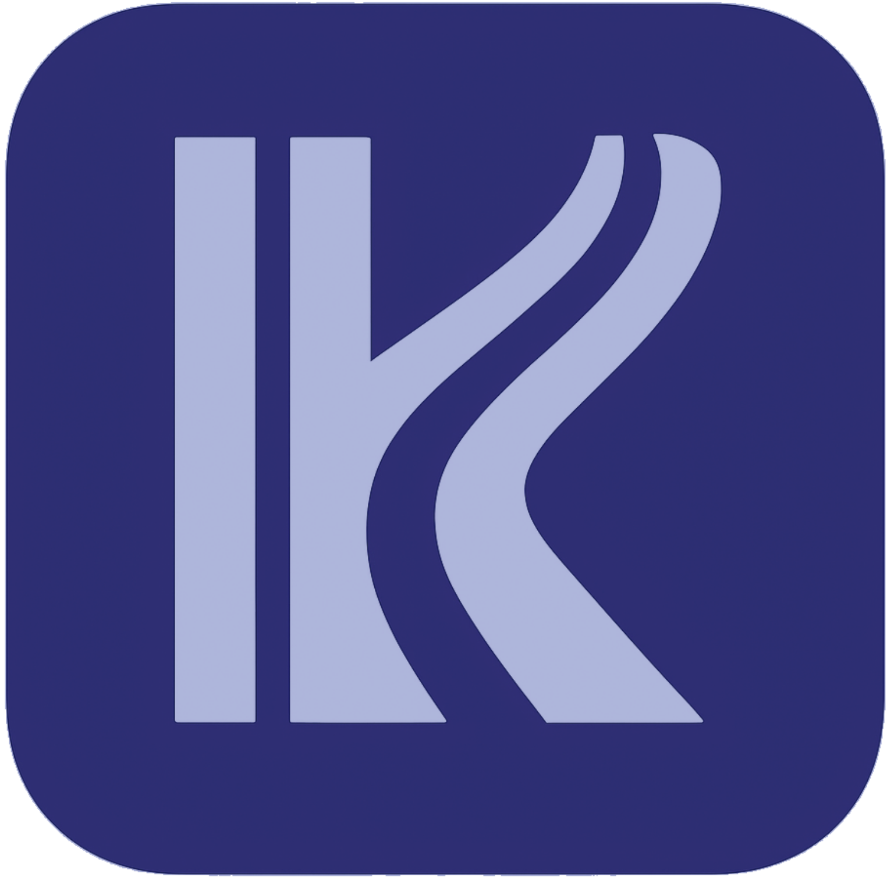

# Kourse - 정보대학의 올바른 Course

<div align="center">
  
  
  **교육과 소통으로 연결하는 강의추천·선배매칭·진로탐색 플랫폼**
  
  [](https://reactjs.org/)
  [](https://www.typescriptlang.org/)
  [](https://vitejs.dev/)
  [](https://tailwindcss.com/)
</div>

---

## 📋 목차

- [프로젝트 소개](#-프로젝트-소개)
- [주요 기능](#-주요-기능)
- [기술 스택](#-기술-스택)
- [시작하기](#-시작하기)
- [프로젝트 구조](#-프로젝트-구조)
- [주요 컴포넌트](#-주요-컴포넌트)
- [API 연동](#-api-연동)
- [상태 관리](#-상태-관리)
- [개발 가이드](#-개발-가이드)
- [배포](#-배포)
- [사용자 시나리오](#-사용자-시나리오)
---

## 🎯 프로젝트 소개

**Kourse**는 정보대 학생들을 위한 통합 학습 관리 플랫폼입니다. "무엇을 들어야 할까?", "이 과목을 들은 선배는 어떻게 활용했을까?", "나의 진로 방향은?"이라는 세 가지 핵심 질문에 답하며, 4년의 대학 생활을 체계적으로 설계할 수 있도록 돕습니다.

### 🎓 타겟 사용자

**고려대학교 정보대학 학생** (1차 목표)
- 컴퓨터학과, 데이터과학과, 사이버국방학과
- 정보대 복수전공/이중전공 학생
- 향후 전체 단과대로 확장 예정

### 🌟 핵심 가치

- **익명이 아닌 검증된 조언**: 실제 과목 이수자와의 연결로 신뢰할 수 있는 정보 제공
- **4학년의 후회를 2학년에**: 진로별 이수체계도 기반 사전 로드맵 제시
- **교육과 소통의 선순환**: 학년이 아닌 과목 중심으로 서로가 서로에게 도움을
- **고려대 이수체계도 기반**: 실제 커리큘럼을 반영한 맞춤형 트랙 추천

---

## 🚀 주요 기능

### 💡 해결하는 문제

#### 1. "수강신청 뭐 담지?"
전공필수? 전공선택? 교양? 명강? 우선순위를 모르는 학생들을 위해
- **AI 기반 시간표 자동 생성**: 사용자 프롬프트로 의사 파악 → 과목별 가중치 부여 → 최적 10개 추천
- **선수과목 자동 필터링**: 이미 이수한 과목 기반으로 수강 가능한 과목만 제시
- **선호도 반영**: 요일, 시간대, 이동시간, 전공 우선순위 고려

#### 2. "이 과목을 들은 사람은 어떻게 활용했을까?"
KLUE는 강의 평가에 불과, 실전 활용법은 사람에게 직접 물어야
- **선수강자 매칭 시스템**: 같은 과목을 이수한 선배와 자동 연결
- **과목 중심 네트워크**: 학년이 아닌 과목으로 연결되는 멘토-멘티 관계
- **실시간 1:1 채팅**: 알고리즘 들었으면 코테 준비? 실전 조언 즉시 공유
- **검증된 정보**: 익명이 아닌, 실제 이수자의 경험담

#### 3. "학점은 채웠는데, 방향성이 없어"
전필·전선 따라 듣다 보니 학점만 채우고 나의 커리어는?
- **이수체계도 기반 진로 추천**: 고려대 컴퓨터학과 이수체계도 활용
- **트랙별 로드맵**: AI/ML, Backend, Frontend, Data Science 등
- **이수율 측정**: 선택한 트랙 대비 현재 진행도 시각화
- **타전공 연계 추천**: 복수전공 시 최적 과목 조합 제안
- **다음 학기 추천**: "이거 공부할 거면 이 과목 들을 걸" 사전 제시

### 📱 기능별 상세

#### 1️⃣ 시간표 자동화 (Schedule)
- 사용자 프롬프트 기반 의사 측정 ("공강 많이", "전공 집중", "교양 먼저")
- Gemini Flash 2.5를 활용한 가중치 계산
- 가중치 기반 랜덤 추출 방식으로 10개 과목 추천
- 시간표 시각화 및 실시간 편집

#### 2️⃣ 선배-후배 매칭 (Mentor/Connections)
- 과목 코드 기반 자동 매칭
- 애플리케이션 내장 채팅 서비스
- 선배의 수강 후기, 프로젝트 경험, 취업 활용 사례 공유
- Cross Major Connections: 타전공 학습 네트워크

#### 3️⃣ 커리어 로드맵 (Career)
- **Dashboard**: 전공필수/선택 이수율, 학점 현황 시각화
- **트랙 추천**: 이수 과목 패턴 분석 → 최적 커리어 경로 제안
- **Roadmap**: 학기별 추천 과목, 선수과목 체크, 난이도 표시
- **다음 과목 추천**: 현재 트랙 기반 후속 과목 자동 제안

#### 4️⃣ 마이페이지 (MyPage)
- 프로필 및 이수 과목 관리
- 수강 선호도 설정 (시간표 자동화에 반영)
- 학습 통계 및 진도율 확인
- 앱 설정 (테마, 알림, 언어)

#### 5️⃣ 채팅 시스템 (Chat)
- 선배-후배 간 1:1 실시간 채팅
- 채팅방 목록 관리
- 과목별 대화 내역 저장

---

## 🎯 경쟁 우위

### 기존 서비스와의 차별점

| 서비스 | 제공 가치 | 한계 | Kourse의 해결 |
|-------|---------|-----|-------------|
| **수강신청 알리미<br/>(고파스)** | 학수번호 복사,<br/>경쟁률 제공 | 의사 반영 위해<br/>결국 시트 정리 필수 | ✅ AI 프롬프트 기반<br/>자동 시간표 생성 |
| **Klue** | 선수강자 강의 후기 | 진로 도움 여부는<br/>미지수 | ✅ 실전 활용법 중심<br/>멘토링 매칭 |
| **에브리타임** | 최대 커뮤니티<br/>(MAU 400만) | 익명성으로 인한<br/>낮은 신뢰성 | ✅ 검증된 이수자와<br/>1:1 연결 |

### 우리만의 가치

1. **"이거 공부할 거면 이 과목 들을 걸" → 4학년의 후회를 2학년에**
   - 고려대 이수체계도 기반 사전 로드맵 제시
   - 트랙별 최적 이수 경로 추천

2. **익명이 아닌 검증된 조언**
   - 실제 과목 이수자만 매칭
   - KLUE로는 알 수 없는 "과목을 어떻게 활용했는지" 직접 질문

3. **교육과 소통의 선순환**
   - 후배는 선배에게 배우고, 선배는 후배에게 보은
   - 학년이 아닌 과목 중심 네트워크

---

## 🛠️ 기술 스택

### Frontend (이 저장소)
- **React 18.2.0** - 반응형 UI 라이브러리
- **TypeScript 5.9.3** - 타입 안정성 및 개발 생산성
- **Vite 5.0.8** - 고속 빌드 도구 및 개발 서버
- **React Router DOM 7.9.6** - SPA 라우팅
- **Tailwind CSS 3.4.18** - 유틸리티 우선 CSS 프레임워크
- **Zustand 5.0.8** - 경량 상태 관리 라이브러리
- **Axios 1.13.2** - HTTP 클라이언트
- **React Flow Renderer 10.3.17** - 로드맵 시각화

### Backend
- **Kotlin + Spring Boot 3.5.4** - 백엔드 서버
- **PostgreSQL** - 관계형 데이터베이스
- **WebSocket** - 실시간 채팅 지원

### AI & 데이터
- **Gemini Flash 2.5** - 사용자 프롬프트 분석 및 가중치 계산
- **고려대 이수체계도 데이터** - 진로 트랙 추천 기반

---

## 🏁 시작하기

### 사전 요구사항

- **Node.js** 18.x 이상
- **npm** 또는 **yarn**

### 설치 및 실행

```bash
# 1. 저장소 클론
git clone <repository-url>
cd webapp

# 2. pro2 브랜치로 이동
git checkout pro2

# 3. 의존성 설치
npm install

# 4. 개발 서버 실행
npm run dev

# 5. 브라우저에서 http://localhost:5173 접속
```

### 빌드

```bash
# 프로덕션 빌드
npm run build

# 빌드 결과 미리보기
npm run preview
```

---

## 📁 프로젝트 구조

```
webapp/
├── src/
│   ├── api/                    # API 통신 관련
│   │   ├── axios.js           # Axios 인스턴스 설정
│   │   └── careerApi.ts       # Career API 함수
│   ├── components/            # 재사용 가능한 컴포넌트
│   │   ├── BottomNav.jsx      # 하단 네비게이션 바
│   │   ├── career/            # Career 페이지 컴포넌트
│   │   │   ├── Dashboard.tsx
│   │   │   ├── CareerRecommendation.tsx
│   │   │   ├── Roadmap.tsx
│   │   │   ├── Connections.tsx
│   │   │   ├── CrossMajorConnections.tsx
│   │   │   └── CourseModal.tsx
│   │   └── mypage/            # MyPage 관련 컴포넌트
│   │       ├── ProfileCard.jsx
│   │       ├── Stats.jsx
│   │       ├── CoursePreferenceCard.jsx
│   │       └── SettingsMenu.jsx
│   ├── data/                  # 목 데이터
│   │   └── mockData.ts
│   ├── pages/                 # 페이지 컴포넌트
│   │   ├── Home.jsx           # 로그인/회원가입
│   │   ├── Schedule.jsx       # 시간표
│   │   ├── Mentor.jsx         # 멘토 찾기
│   │   ├── Career.jsx         # 커리어 로드맵
│   │   ├── MyPage.jsx         # 마이페이지
│   │   ├── ChatList.jsx       # 채팅 목록
│   │   ├── Chat.jsx           # 채팅방
│   │   └── ...                # 기타 설정 페이지
│   ├── store/                 # Zustand 상태 관리
│   │   ├── authStore.ts       # 인증 상태
│   │   ├── careerStore.ts     # Career 데이터
│   │   └── themeStore.ts      # 테마 설정
│   ├── types/                 # TypeScript 타입 정의
│   │   ├── career.ts
│   │   └── major.ts
│   ├── App.jsx               # 루트 컴포넌트
│   ├── App.css               # 전역 스타일
│   ├── index.css             # Tailwind 진입점
│   └── main.jsx              # 앱 진입점
├── index.html                # HTML 템플릿
├── vite.config.js            # Vite 설정
├── tailwind.config.js        # Tailwind 설정
├── tsconfig.json             # TypeScript 설정
├── package.json              # 프로젝트 메타데이터
└── README.md                 # 프로젝트 문서
```

---

## 🧩 주요 컴포넌트

### Career 모듈

| 컴포넌트 | 역할 | 주요 데이터 |
|---------|------|------------|
| **Dashboard** | 학점·이수 현황 요약 | `completedCourses` |
| **CareerRecommendation** | 트랙 추천 및 선택 | `tracks`, `selectedTrack` |
| **Roadmap** | 학기별 로드맵, 다음 과목 추천 | `allCourses`, `selectedTrack`, `completedCourses` |
| **Connections** | 선수 수강자 매칭 | `studentConnections` |
| **CrossMajorConnections** | 타전공 학습 네트워크 | 크로스 메이저 데이터 |
| **CourseModal** | 과목 상세 정보 모달 | 과목 상세 데이터 |

### Navigation

- **BottomNav**: 하단 네비게이션 바
  - Schedule (시간표)
  - Mentor (멘토)
  - Career (커리어)
  - MyPage (마이페이지)

---

## 🔌 API 연동

### Base URL
- 개발 환경: `/api` → Proxy to `http://inthon.fjey.me:8080`

### 주요 엔드포인트

#### 인증
```typescript
POST /login          // 로그인
POST /register       // 회원가입
```

#### 시간표
```typescript
GET  /api/schedule/recommend      // 시간표 자동화 결과
POST /api/course-preferences      // 사용자 제약 조건 저장
```

#### Career
```typescript
GET /api/courses/:id/connections  // 같은 과목 학우 목록
GET /api/tracks/recommend         // 진로 트랙 추천
GET /api/roadmap/next-courses     // 다음 학기 추천
```

### API 클라이언트 설정

```javascript
// src/api/axios.js
import axios from 'axios';

const instance = axios.create({
  baseURL: '/api',
  timeout: 10000,
});

// 요청 인터셉터 (토큰 자동 추가)
instance.interceptors.request.use((config) => {
  const token = localStorage.getItem('token');
  if (token) {
    config.headers.Authorization = `Bearer ${token}`;
  }
  return config;
});

export default instance;
```

---

## 🗄️ 상태 관리

### Zustand Stores

#### 1. authStore
```typescript
interface AuthState {
  isLoggedIn: boolean;
  token: string | null;
  login: (token: string) => void;
  logout: () => void;
  checkLogin: () => void;
}
```

#### 2. careerStore
```typescript
interface CareerState {
  completedCourses: Course[];
  allCourses: Course[];
  tracks: Track[];
  selectedTrack: Track | null;
  studentConnections: Connection[];
  // ... 기타 메서드
}
```

#### 3. themeStore
```typescript
interface ThemeState {
  theme: 'light' | 'dark' | 'system';
  setTheme: (theme: string) => void;
  initTheme: () => void;
}
```

---

## 👨‍💻 개발 가이드

### 브랜치 전략

- `main` - 프로덕션 브랜치
- `pro1`, `pro2`, `pro3` - 주요 기능 브랜치
- `genspark_ai_developer` - AI 개발 전용 브랜치

### 코드 컨벤션

#### 파일 명명 규칙
- **컴포넌트**: PascalCase (예: `Dashboard.tsx`)
- **유틸리티/Helper**: camelCase (예: `formatDate.ts`)
- **Store**: camelCase + Store suffix (예: `authStore.ts`)

#### 컴포넌트 구조
```jsx
// 1. Import
import { useState } from 'react';

// 2. Type/Interface (TypeScript)
interface Props {
  title: string;
}

// 3. Component
function Component({ title }: Props) {
  // 3-1. Hooks
  const [state, setState] = useState();
  
  // 3-2. Handlers
  const handleClick = () => {};
  
  // 3-3. Render
  return <div>{title}</div>;
}

// 4. Export
export default Component;
```

---

## 🚢 배포

### 프로덕션 빌드
```bash
npm run build
```

빌드 결과물은 `dist/` 디렉토리에 생성됩니다.

### 환경 변수

프로덕션 환경에서는 `.env.production` 파일 생성:

```env
VITE_API_BASE_URL=https://api.yourdomain.com
```

### 서버 배포 옵션

#### 1. Vercel
```bash
npm install -g vercel
vercel --prod
```

#### 2. Netlify
```bash
npm install -g netlify-cli
netlify deploy --prod
```

#### 3. GitHub Pages
```bash
# vite.config.js에 base 추가
export default defineConfig({
  base: '/repository-name/',
  // ...
});

npm run build
# dist 폴더를 gh-pages 브랜치에 배포
```

---

## 🔧 트러블슈팅

### 흔한 문제들

#### 1. API 연결 실패
```
Error: Network Error
```
**해결**: `vite.config.js`의 proxy 설정 확인

#### 2. 타입 에러
```
TS2307: Cannot find module
```
**해결**: `tsconfig.json`의 paths 설정 확인 또는 `npm install` 재실행

#### 3. 빌드 에러
```
RollupError: Could not resolve
```
**해결**: `node_modules` 삭제 후 재설치

---

## 📊 사용자 시나리오

### 정보대 2학년 김민수 학생의 하루

#### 🕐 아침 9시: 수강신청 고민 시작
"다음 학기에 뭘 들어야 하지? 알고리즘? 데이터베이스? 공강은 어떻게 만들지?"

**[Kourse 솔루션]**
1. Schedule 페이지 접속
2. "전공 집중하고 싶고, 수요일은 공강으로 만들고 싶어요" 입력
3. AI가 10개 최적 과목 추천 (가중치 기반)
4. 클릭 몇 번으로 시간표 완성 ✅

#### 🕐 오후 2시: 알고리즘 수강 결정
"알고리즘 들으면 코테 준비가 될까? 실제로 들은 사람한테 물어보고 싶은데..."

**[Kourse 솔루션]**
1. Mentor 페이지에서 "알고리즘" 검색
2. 이미 이수한 선배 3명 자동 매칭
3. 3학년 박선배와 채팅 연결
4. "코테 3문제 풀 정도 실력 늘었어요" 실전 조언 획득 ✅

#### 🕐 저녁 7시: 진로 고민
"나 AI 쪽으로 가고 싶은데, 어떤 과목들을 들어야 하지?"

**[Kourse 솔루션]**
1. Career 페이지에서 "AI/ML" 트랙 선택
2. 이수체계도 기반 로드맵 확인
3. 현재 이수율 42% 표시
4. 다음 학기 추천: "머신러닝", "딥러닝" 자동 제안
5. 4년 계획 한눈에 파악 ✅

### 결과
❌ 기존: 3일간 고민 + 에타 검색 + 선배 찾기 + 엑셀 정리
✅ Kourse: 1시간 내 의사결정 완료 + 검증된 정보 획득 + 4년 계획 수립
